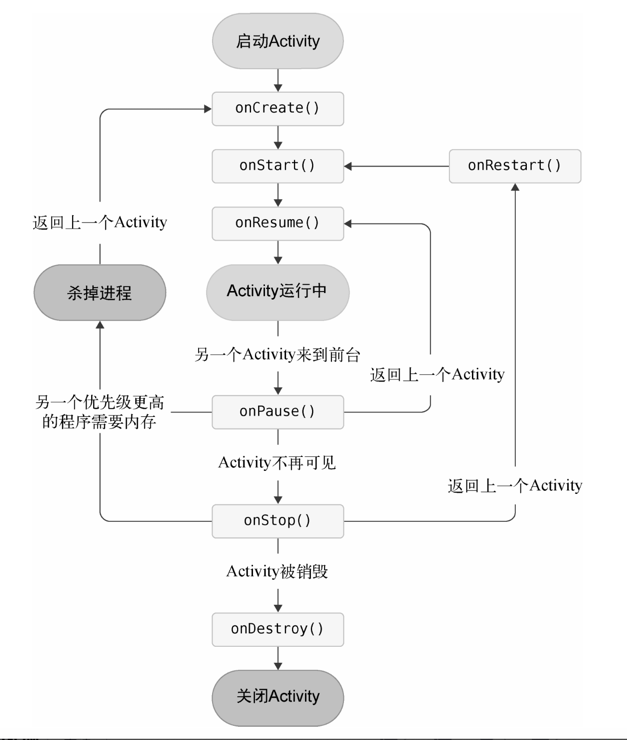

# 安卓学习笔记

## Session 1

> 安卓四大组件
> 
Activity、Service、Broadcast Receiver、Content Provider


> 项目结构

app/src/main：

/java 编写代码主要的地方

/res 资源存放地   图片放在drawable 目录下，布局放在layout 目录下，字符串放在values 目录下


**bulid.gradle**
这是app模块的gradle构建脚本


> AndroidManifest.xml

整个Android 项目的配置文件，你在程序中定义的所有四大组件都需要在这个文件里注 册
```xml
<activity android:name=".MainActivity"> <intent-filter>
    <action android:name="android.intent.action.MAIN" />
    <category android:name="android.intent.category.LAUNCHER" /> </intent-filter>
</activity>
```
表示MainActivity 是这个 项目的主Activity ，在手机上点击应用图标，首先启动的就是这个Activity 。

内容被遮挡），通过 lambda 参数传递给内部 UI。


> res文件夹详解

x x x-hdpi 、x x x-xhdpi 、x x x-xxhdpi
这些是属于图标的不同分辨率，用于兼容各类设备

**drawable-xxhdpi** 是主流

> strings.xml

```xml
<resources>
<string name="app_name">HelloWorld</string>
</resources>
```
有以下两种方式来引用app_name：

1. 在代码中通过R.string.app_name可以获得该字符串的引用。
2. 在XML中通过@string/app_name可以获得该字符串的引用

其中string部分是可以替换的，如果是引用的图片资源就可 以替换成drawable，
如果是引用的应用图标就可以替换成mipmap，
如果是引用的布局文件就 可以替换成layout，以此类推。

> build.gradle文件

**最外层的build.gradle**

统一管理所有子模块（比如 app 模块）能用的插件，且只「声明插件存在」，但不直接启用。

gradle/libs.versions.toml负责定义版本（新写法）

apply false：「不立即启用插件」—— 只告诉 gradle「这个插件我项目里有」，
但不在这个顶层文件里启用；
哪个子模块（比如 app 模块）需要用，
就在子模块的build.gradle里写apply true（或直接声明插件）。


**子模块（app文件夹）的gradle文件**

```groovy
    buildTypes {
        release {
        minifyEnabled false
        proguardFiles getDefaultProguardFile('proguard-android-optimize.txt'), 'proguard-rules.pro'
        }
    }
```
**minifyEnabled**   指代码混淆，防止代码被反编译破解


proguard-android.txt vs proguard-android-optimize.txt？

proguard-android.txt：仅混淆，不做代码优化（更保守）；
proguard-android-optimize.txt：混淆 + 代码优化（比如删除未使用的代码、简化逻辑），体积更小，是新版默认推荐。

> log日志

vdiew  五种级别

logcat看日志即可  

过滤器 新版本更智能了 直接写条件就好了


## Session 3

**跳过kotlin**

四大组件

### Activity

#### 一些用法
layout放布局页面文件

在XML中引用一个id，就使用@id/id_name这种语法，而如果你需要在XML中定义一 个id，则要使用@+id/id_name这种语法  


setContentView()方法来给当前的Activity 
加载一个布局，而在 setContentView()方法中，我们一般会传入一个布局文件的id


所有的Activity都要在AndroidManifest.xml 中进行注册才能生效


配置主Activity 的方法就是在<activity>标签的内部加入<intent-filter> 标签，
并在这个标签里添加<action android:name="android.intent.action.MAIN"/>和<category android:name="android.intent.category.LAUNCHER" />这两句声明即可。

> 总体流程

androidmanifest -> 注册一个activity -> setcontentview加载一个布局文件

> 使用toast

什么是toast？
Toast 是Android 系统提供的一种非常好的提醒方式，
在程序中可以使用它将一些短小的信息通知给用户，
这些信息会在一段时间后自动消失。

```java
//view类
    public void setOnClickListener(@Nullable OnClickListener l) {
        throw new RuntimeException("Stub!");
    }
    public interface OnClickListener { //内部接口
        void onClick(View var1);
    }

   //用法lamdba表达式
public void example()
{
        botton1.setOnClickListener(v->
        Toast.makeText(this,"You clicked Button 1", Toast.LENGTH_SHORT).show()//
        );
}


public static Toast makeText(Context context, @StringRes int resId, @Duration int duration)
        throws Resources.NotFoundException {
    return makeText(context, context.getResources().getText(resId), duration);
}

public static Toast makeText(Context context, CharSequence text, @Duration int duration) {
    return makeText(context, null, text, duration);
}

/**
 * Make a standard toast to display using the specified looper.
 * If looper is null, Looper.myLooper() is used.
 *
 * @hide
 */
public static Toast makeText(@NonNull Context context, @Nullable Looper looper,
                             @NonNull CharSequence text, @Duration int duration) {
    Toast result = new Toast(context, looper);

    if (Compatibility.isChangeEnabled(CHANGE_TEXT_TOASTS_IN_THE_SYSTEM)) {
        result.mText = text;
    } else {
        result.mNextView = ToastPresenter.getTextToastView(context, text);
    }

    result.mDuration = duration;
    return result;
}
```

button类继承textview类 textview类继承view类

通过调用setOnClickListener()方法为按钮注册一个监听 器，点击按钮时就会执行监听器中的onClick()方法

Toast类的静态方法makeText() 

makeText()方法需要传入3个参数。
第一个 参数是Context，也就是Toast要求的上下文，
由于Activity本身就是一个Context对象，（继承）
因此这里直接传入this即可。
第二个参数是Toast 显示的文本内容。
第三个参数是Toast 显示的时长，有两个内置常量可以选择:Toast.LENGTH_SHORT和Toast.LENGTH_LONG。


题外话：使用viewbinding可以替代繁琐的多刺findviewbyid。

> 使用Menu

一种菜单功能

```java
    @Override
    public boolean onCreateOptionsMenu(Menu menu)
    {
        getMenuInflater().inflate(R.menu.main,menu); //因为继承了Activity ，所以直接复用父类方法。
        return true;
    }

    @Override
    public boolean onOptionsItemSelected(MenuItem item)
    {
    
        int itemId = item.getItemId();
        if(itemId == R.id.add_item)
        {
            Toast.makeText(this,"You clicked Add",Toast.LENGTH_SHORT).show();
        }else if(itemId ==R.id.remove_item)
        {
            Toast.makeText(this,"You clicked Remove",Toast.LENGTH_SHORT).show();
        }
    
        return true;
    
    
    }
```

onCreateOptionsMenu 是 Activity 的生命周期方法之一，
当用户点击「菜单按钮（三点图标 / 物理菜单键）」时，
系统会回调这个方法，让你「加载并显示自定义的菜单布局」。

Menu 是 Android 系统提供的「菜单容器类」，
属于 android.view 包，核心是「管理菜单的所有选项（菜单项）」，
你可以把它理解成「菜单的 “容器 / 清单”」。


> 为什么不都写在onCreate方法？

onCreate() 在 Activity 启动时只执行一次

onCreateOptionsMenu()	用户点击「菜单按钮 / 三点图标」时（按需执行）

onOptionsItemSelected()	用户点击菜单项时（按需执行）

最主要是懒加载，其次是生命周期要区别开


> 关键对比：手动监听 vs 系统回调（为什么不用手动 setOnClickListener？）

你可能会想：“按钮可以用 setOnClickListener，为什么菜单不用？”

按钮是「你自己的 View」，需要手动绑定监听；

菜单是「系统管理的 UI」，系统已经帮你做了所有监听工作，
只需要通过回调方法接收结果即可 —— 这是 Android 对系统级 UI 的统一设计（比如 ActionBar、状态栏通知都是这个逻辑）。

debug实测，调用activity的onPreparePanel方法 才会初始化menu。

> 销毁app

就是退出功能，调用finish（） 即可

> 使用Intent在Activity之间跳转

Intent 大致可以分为两种:显式Intent 和隐式Intent

Intent 一般可用于启动Activity、启动Service 以 及发送广播等场景

```java

//显式调用
binding.button1.setOnClickListener(new View.OnClickListener() {
            @Override
            public void onClick(View v) {
                Intent intent= new Intent(MainActivity.this, SecondActivity.class);
                startActivity(intent);
            }
        });

//隐式调用
通过在<activity>标签下配置<intent-filter>的内容，可以指定当前Activity 能够响应的 action和category

        <intent-filter>
                <action android:name="com.example.myapplication.ACTION_START" />
                <category android:name="android.intent.category.DEFAULT" />
            </intent-filter>
```

小坑：Android 12+ 要求「有 intent-filter 的 Activity 必须显式设 exported="true"」，否则系统找不到可处理该 Intent 的 Activity。

隐式 Intent 的自动匹配本质就是「用 Action、Category、Data 这三类核心条件层层过滤」，最终找到能处理这个 Intent 的组件。


exported=false	系统会剔除该组件（隐式 Intent 匹配不到）	仅可被应用内部显式 Intent 唤起

添加自定义category时必须要带默认的

其他的用法：
```java
Intent intent=new Intent(Intent.ACTION_VIEW);
intent.setData(Uri.parse("https://www.baidu.com"));
startActivity(intent);
//浏览网页
```


与此对应，我们还可以在<intent-filter>标签中再配置一个<data>标签，
用于更精确地指 定当前Activity 能够响应的数据。<data>标签中主要可以配置以下内容。
- android:scheme。用于指定数据的协议部分，如上例中的https 部分。 
- android:host。用于指定数据的主机名部分，如上例中的www.baidu.com 部分。 
- android:port。用于指定数据的端口部分，一般紧随在主机名之后。 
- android:path。用于指定主机名和端口之后的部分，如一段网址中跟在域名之后的内 容。 
- android:mimeType。用于指定可以处理的数据类型，允许使用通配符的方式进行指定。

只有当<data>标签中指定的内容和Intent 中携带的Data 完全一致 时，当前Activity 才能够响应 该Intent 

除了https 协议外，我们还可以指定很多其他协议，比如geo 表示显示地理位置、tel 表示拨打电话

> 向下一个 Activity 传递数据（启动时传，最常用）

核心：通过 Intent 携带数据，下一个 Activity 从 Intent 中获取。

intent.putExtra("key", 数据);

数据类型 变量 = intent.getXXXExtra("key", 默认值); 

> 向上一个传递数据

核心：startActivityForResult()/Activity Result API + setResult()，上一个 Activity 监听返回结果。

#### 生命周期

> 返回栈

每启动一个 新的Activity ，就会覆盖在原Activity 之上，然后点击Back 键会销毁最上面的Activity ，下面的 一个Activity 就会重新显示出来。

每当我 们按下Back 键或调用finish()方法去销毁一个Activity 时，处于栈顶的Activity 就会出栈，前一个入栈的Activity 就会重新处于栈顶的位置。系统总是会显示处于栈顶的Activity 给用户

> 四个状态

运行状态、暂停状态、停止状态、销毁状态

暂停：不在栈顶，但仍然可见的，会进入暂停状态，例如对话框。内存极低时才考虑回收

停止状态：不可见且不在栈顶的。系统仍然 会为这种Activity 保存相应的状态和成员变量，但是这并不是完全可靠的，当其他地方需要 内存时，处于停止状态的Activity 有可能会被系统回收。

销毁状态：一个Activity从返回栈中移除后就变成了销毁状态。系统最倾向于回收处于这种状态的
Activity ，以保证手机的内存充足。

> 七个回调方法

- onCreate()。这个方法你已经看到过很多次了，我们在每个Activity 中都重写了这个方 法，它会在Activity 第一次被创建的时候调用。你应该在这个方法中完成Activity 的初始化 操作，比如加载布局、绑定事件等。
- onStart()。这个方法在Activity 由不可见变为可见的时候调用。 
- onResume()。这个方法在Activity 准备好和用户进行交互的时候调用。此时的Activity 一 定位于返回栈的栈顶，并且处于运行状态。
- onPause()。这个方法在系统准备去启动或者恢复另一个Activity 的时候调用。我们通常 会在这个方法中将一些消耗CPU的资源释放掉，以及保存一些关键数据，但这个方法的执 行速度一定要快，不然会影响到新的栈顶Activity 的使用。 
- onStop()。这个方法在Activity 完全不可见的时候调用。它和onPause()方法的主要区 别在于，如果启动的新Activity 是一个对话框式的Activity ，那么onPause()方法会得到执 行，而onStop()方法并不会执行。
- onDestroy()。这个方法在Activity 被销毁之前调用，之后Activity 的状态将变为销毁状 态。
- onRestart()。这个方法在Activity 由停止状态变为运行状态之前调用，也就是Activity被重新启动了。

> 三种生存期细分
- 完整生存期。Activity 在onCreate()方法和onDestroy()方法之间所经历的就是完整生 存期。一般情况下，一个Activity 会在onCreate()方法中完成各种初始化操作，而在 onDestroy()方法中完成释放内存的操作。
- 可见生存期。Activity 在onStart()方法和onStop()方法之间所经历的就是可见生存 期。在可见生存期内，Activity 对于用户总是可见的，即便有可能无法和用户进行交互。我 们可以通过这两个方法合理地管理那些对用户可见的资源。比如在onStart()方法中对资 源进行加载，而在onStop()方法中对资源进行释放，从而保证处于停止状态的Activity 不 会占用过多内存。
- 前台生存期。Activity 在onResume()方法和onPause()方法之间所经历的就是前台生存 期。在前台生存期内，Activity 总是处于运行状态，此时的Activity 是可以和用户进行交互 的，我们平时看到和接触最多的就是这个状态下的Activity 。




#### Activity的启动模式

四种：standard、singleTop、singleTask 和 singleInstance

> standard模式

默认模式

在standard 模式下，每当启动一个新的Activity ，
它就会在返回栈中入栈，并处于栈顶的位置。对于使用standard模式的Activity ，
系统不会在乎这个Activity 是否已经在返回栈中存在，每次启动都会创建一个该 Activity 的新实例。

也就是说 你是可以在同一个activity上不断新建相同的activity的

> singleTop模式

简单说 就是如果该Activity 已经在栈顶就不会再新建了，但是不在栈顶的话，如现在在用另外一个Activity，则启动时会新建新的


> singleTask模式


每次启动该Activity时， 系统首先会在返回栈中检查是否存在该Activity 的实例，
如果发现已经存在则直接使用该实例， 并把在这个Activity 之上的所有其他Activity 统统出栈，
如果没有发现就会创建一个新的 Activity 实例。

仅销毁「同一任务栈中」目标 Activity 之上的 Activity，跨任务栈的 Activity 不受影响。
**有风险**

> singleInstance模式

定为singleInstance 模式的Activity 会启用一个新 的返回栈来管理这个Activity (其实如果singleT ask 模式指定了不同的taskAffinity ，也会启动 一个新的返回栈)

- 独占任务栈：
启动 singleInstance 的 Activity 时，系统会为它创建一个「新的、独立的任务栈」（栈里只有它自己），和应用默认的任务栈完全分离；
- 全局唯一实例：
整个系统中，该 Activity 只有一个实例 —— 无论从哪个应用 / 哪个任务栈启动它，都会复用这个唯一实例，且自动切换到它的独立栈；
- 返回逻辑特殊：
从 singleInstance Activity 按返回键：会先回到 “启动它的那个任务栈的栈顶页面”，而非销毁自己；
例：应用默认栈（A→B）→ 启动 singleInstance 的 C → 按返回键 → 回到 B，而非销毁 C；
- 其他 Activity 无法进入它的栈：
哪怕用 Intent 跳转到 C 之后再启动 D，D 也会被放入「启动 C 的原任务栈」（而非 C 的独立栈）。


想实现其他程序和我们的程序可以共享这个Activity 的实 例，应该如何实现呢?
使用前面3 种启动模式肯定是做不到的，因为每个应用程序都会有自己的返回栈，同一个Activity 在不同的返回栈中入栈时必然创建了新的实例。而使用
singleInstance 模式就可以解决这个问题， 
在这种模式下，会有一个单独的返回栈来管理这个 Activity ，不管是哪个应用程序来访问这个Activity ，都共用同一个返回栈，也就解决了共享 Activity 实例的问题。


 

#### 一些实践

返回键仅仅是退出
可以写一个类，通过全局列表保存所有的Activity，然后搞一个按钮来销毁全部。

快速获取传输参数
```java
public class SecondActivity extends AppCompatActivity {
    // 1. 定义参数Key（可选，但建议统一维护，避免硬编码）
    private static final String EXTRA_PARAM1 = "param1";
    private static final String EXTRA_PARAM2 = "param2";

    // 2. 封装静态启动方法（核心）
    public static void actionStart(Context context, String data1, String data2) {
        // 构建Intent并传递参数
        Intent intent = new Intent(context, SecondActivity.class);
        intent.putExtra(EXTRA_PARAM1, data1);
        intent.putExtra(EXTRA_PARAM2, data2);
        // 启动Activity（若context非Activity，需加FLAG_ACTIVITY_NEW_TASK，避免崩溃）
        if (!(context instanceof Activity)) {
            intent.addFlags(Intent.FLAG_ACTIVITY_NEW_TASK);
        }
        context.startActivity(intent);
    }

    // 3. （可选）封装参数读取方法，进一步简化内部取值逻辑
    private String getParam1() {
        return getIntent().getStringExtra(EXTRA_PARAM1);
    }

    private String getParam2() {
        return getIntent().getStringExtra(EXTRA_PARAM2);
    }

    // ... 其他生命周期/业务逻辑
}
```

就是接口化了  没啥特别


### Session 4
UI开发

我、